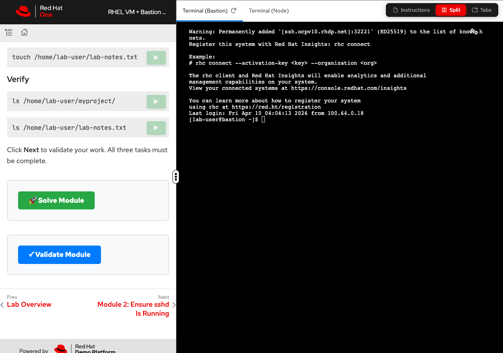

= RHEL VM + Bastion — E2E Testing Example

Students work on a RHEL VM via an SSH bastion. No OCP cluster. The zt-runner runs as a Podman container on the bastion using SSH keys at `/app/.ssh/`.

== Setup — Copy 3 Files Into Your Showroom

[source,sh]
----
git clone https://github.com/rhpds/showroom_template_nookbag.git /tmp/ref-showroom
cd /tmp/ref-showroom && git checkout e2e-template
cd ~/path/to/YOUR-SHOWROOM-REPO

mkdir -p content/supplemental-ui/js content/supplemental-ui/css content/lib
cp /tmp/ref-showroom/content/supplemental-ui/js/buttons.js      content/supplemental-ui/js/
cp /tmp/ref-showroom/content/supplemental-ui/css/site-extra.css content/supplemental-ui/css/
cp /tmp/ref-showroom/content/lib/inject-buttons.js              content/lib/
----

Register the Antora extension in `site.yml`:

[source,yaml]
----
antora:
  extensions:
    - require: ./content/lib/dev-mode.js
      enabled: false
    - require: ./content/lib/inject-buttons.js
----

== Send-To Terminal

Tab URL in `ui-config.yml`: `/wetty (bastion) and /terminal/ (node)`

Use `role="send-to-wetty" (bastion) | role="send-to-terminal" (node at /terminal/)` on code blocks.

== ServiceAccount

No SA — runner is Podman on bastion. Uses `/app/.ssh/id_rsa` and `/app/.ssh/config` for SSH to node.

== What Is Included

* `module-01-solve-send-to-example.adoc` — send-to code blocks, solve/validate placeholders, developer workflow with curl commands
* `module-02-agv.adoc` — AgnosticV settings for this lab type
* `runtime-automation/module-01/` and `module-02/` — example solve.yml and validate.yml
* `conclusion.adoc` — wrap-up and reference repos

== What the Buttons Look Like

The ▶ button on each code block sends the command to the terminal tab.
The *Solve* and *Validate* buttons appear at the bottom of each module page.

== Note on Solve/Validate at Summit

NOTE: Solve and Validate buttons are for *development only* (demos, internal workshops).
At Summit/production events, Demolition or the load test Ansible role calls
`/stream/solve` and `/stream/validate` automatically — *buttons are not added to Summit lab modules*.
